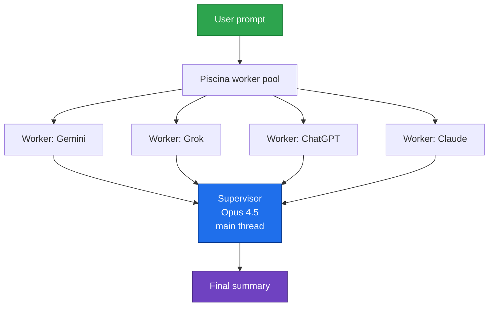
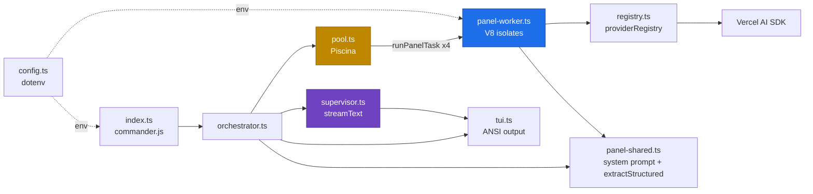

# ai-lobby

A terminal tool that fans out a single prompt to **Gemini, Grok, ChatGPT, and Claude** in parallel, collects their answers, and synthesizes them into a final summary with **Claude Opus 4.5** as a supervisor.



**Stack:** [Vercel AI SDK](https://ai-sdk.dev/) (one `generateText` / `streamText` API across 4 providers) · [Piscina](https://github.com/piscisaureus/piscina) (worker thread pool) · [commander.js](https://github.com/tj/commander.js) · [dotenv](https://github.com/motdotla/dotenv) · Bun runtime.

## Installation

```bash
bun install
cp .env.example .env
# Fill in at least one API key in .env
```

### Where to get API keys

| Provider | Key |
|----------|-----|
| Gemini   | https://aistudio.google.com/apikey |
| Grok     | https://console.x.ai |
| ChatGPT  | https://platform.openai.com/api-keys |
| Claude   | https://console.anthropic.com |

Providers with missing keys are skipped automatically; the rest are not blocked.

## LLM Gateways

Two ways to route traffic through a gateway (OpenRouter, LiteLLM, Together, custom proxy, etc.):

### Option A — generic `gateway` panelist slot

Set both `GATEWAY_API_KEY` and `GATEWAY_BASE_URL`. A 5th panelist labeled "Gateway" is added with model IDs prefixed `gateway:`. Missing either var skips the slot, same as the other providers.

```bash
# OpenRouter example
GATEWAY_API_KEY=sk-or-v1-...
GATEWAY_BASE_URL=https://openrouter.ai/api/v1
GATEWAY_MODEL=gateway:anthropic/claude-3.5-sonnet
# Optional attribution headers (recommended for OpenRouter)
GATEWAY_APP_URL=https://github.com/lynicis/ai-lobby
GATEWAY_APP_TITLE=ai-lobby
```

```bash
# LiteLLM proxy example
GATEWAY_API_KEY=sk-litellm-...
GATEWAY_BASE_URL=http://localhost:4000/v1
GATEWAY_MODEL=gateway:gpt-4o
```

The supervisor also follows this routing when you set `SUPERVISOR_MODEL=gateway:...`.

### Option B — per-provider baseURL override

Route a single first-party provider through a compatible gateway while keeping its native `<provider>:<model>` id and color. Leave the variable empty to use the default endpoint.

```bash
# Route ChatGPT through OpenRouter
OPENAI_BASE_URL=https://openrouter.ai/api/v1
OPENAI_MODEL=openai:anthropic/claude-3.5-sonnet
```

The same pattern works with `ANTHROPIC_BASE_URL`, `GOOGLE_BASE_URL`, and `XAI_BASE_URL`.

Both options can be combined freely.

## Usage

```bash
# Normal flow: 4 models + supervisor synthesis
bun run start "Explain quantum entanglement in 3 paragraphs"

# Prompt via stdin
echo "Best language for CLIs in 2026?" | bun run start

# Raw answers only, no supervisor
bun run start --no-supervisor "Compare React vs Vue"

# JSON output (for CI / scripting)
bun run start --raw "What is the capital of France?"

# Custom supervisor model
bun run start --supervisor-model anthropic:claude-sonnet-4-5 "..."

# Help / version
bun run start --help
bun run start --version
```

## Environment variables (`.env`)

| Variable | Default | Description |
|----------|---------|-------------|
| `GEMINI_API_KEY` | — | Gemini panelist |
| `GROK_API_KEY` | — | Grok panelist (`openai-compatible` provider, xAI base URL) |
| `OPENAI_API_KEY` | — | ChatGPT panelist |
| `ANTHROPIC_API_KEY` | — | Claude panelist + supervisor |
| `GATEWAY_API_KEY` | — | Generic OpenAI-compatible gateway panelist (requires `GATEWAY_BASE_URL`) |
| `GATEWAY_BASE_URL` | — | Base URL for the gateway panelist (e.g. `https://openrouter.ai/api/v1`) |
| `GATEWAY_MODEL` | `gateway:gpt-4o` | Model id for the gateway panelist |
| `GATEWAY_APP_URL` | — | Optional `HTTP-Referer` header for OpenRouter-style attribution |
| `GATEWAY_APP_TITLE` | `ai-lobby` | Optional `X-Title` header for OpenRouter-style attribution |
| `SUPERVISOR_MODEL` | `anthropic:claude-opus-4-5` | Synthesis model |
| `CLAUDE_PANEL_MODEL` | `anthropic:claude-sonnet-4-5` | Claude panelist |
| `GEMINI_MODEL` | `google:gemini-2.5-pro` | |
| `GROK_MODEL` | `openai-compatible:grok-4-latest` | |
| `OPENAI_MODEL` | `openai:gpt-4o` | |
| `ANTHROPIC_BASE_URL` | — | Override Anthropic endpoint (e.g. proxy/gateway) |
| `OPENAI_BASE_URL` | — | Override OpenAI endpoint |
| `GOOGLE_BASE_URL` | — | Override Gemini endpoint |
| `XAI_BASE_URL` | — | Override xAI/Grok endpoint |
| `DEFAULT_TIMEOUT_MS` | `60000` | Per-panelist timeout in ms |

> **Vercel AI SDK** model ID format is `<provider>:<model>`. Each provider is a namespace in the registry, e.g. `registry.languageModel("google:gemini-2.5-pro")`.

## Architecture



- `src/index.ts` — **commander.js** CLI entry point, arg parsing + stdin fallback
- `src/config.ts` — **dotenv/config** env loading, key parsing
- `src/registry.ts` — Vercel AI SDK `createProviderRegistry`: Google, OpenAI, Anthropic, OpenAI-compatible (xAI)
- `src/pool.ts` — **Piscina** worker thread pool (one isolated V8 isolate per panelist)
- `src/panel-worker.ts` — Piscina task default export; one panelist `generateText` call with per-worker `AbortController` timeout
- `src/panel-shared.ts` — Panelist system prompt + `extractStructured` (shared between worker and main)
- `src/orchestrator.ts` — Fans out 4 parallel `pool.run` calls; merges results back into deterministic panel order
- `src/supervisor.ts` — Opus 4.5 `streamText` synthesis (live-printing)
- `src/tui.ts` — Colored terminal output (ANSI, TTY-aware)
- `src/types.ts` — `ModelResponse` / `PanelEntry` / `StructuredAnswer` types

> **Piscina loads worker files from TS source** (`filename: panel-worker.ts`). This works under the **Bun runtime only**; on Node the worker file must be pre-built to `.js`.

## v0.2.0 — Package changes

| Removed | Added |
|---------|-------|
| `@google/genai` | `ai` |
| `openai` | `@ai-sdk/google` |
| `@anthropic-ai/sdk` | `@ai-sdk/openai` |
| (custom arg parser) | `@ai-sdk/anthropic` |
| (custom dotenv loader) | `@ai-sdk/openai-compatible` |
| | `commander` |
| | `dotenv` |
| | `piscina` |

Four separate SDKs → **one SDK** with 4 providers. Custom arg parser → **commander.js**. Custom env loader → **dotenv**. Promise fan-out → **Piscina worker pool**.

## Out of scope

- Conversation history (each call is stateless)
- Cost / token tracking
- Multi-turn debate
- Web UI

## License

MIT